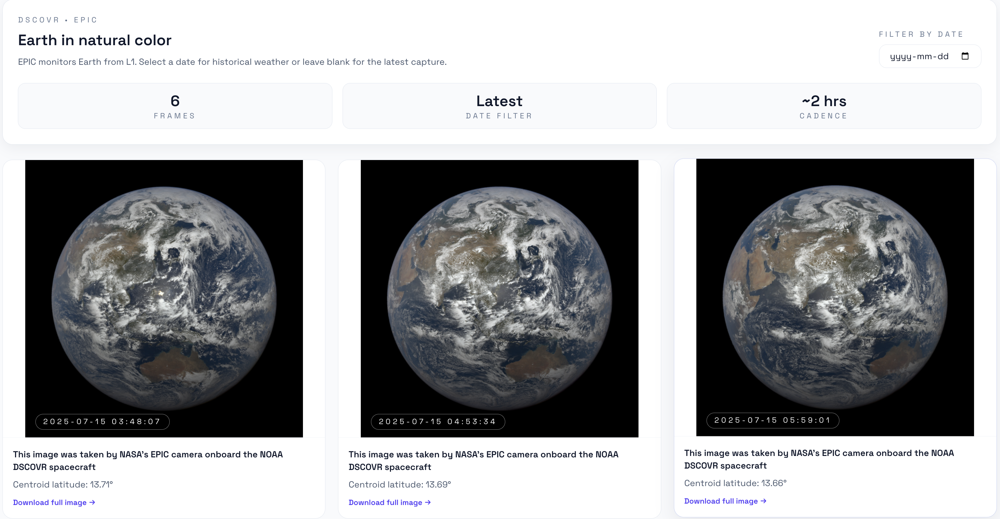

# NASA Explorer

A modern web application for exploring NASA's public datasets, real-time mission data, and interactive 3D models of spacecraft and telescopes. Built with React, Vite, and Three.js.

## Features

- **Home Dashboard** - Overview of featured NASA missions and 3D interactive Perseverance rover
- **Earth EPIC** - Natural-color imagery of Earth from the DSCOVR satellite
- **Asteroid Watch** - Seven-day near-Earth object tracking with velocity and distance data
- **3D Model Library** - 108+ interactive 3D models of NASA spacecraft, telescopes, and equipment
- **Mars Rover** - Historical photo archives from Mars missions (Curiosity rover)
- **Astronomy Picture of the Day** - Daily featured astronomy images with descriptions


## Tech Stack

- **Frontend Framework:** React 19 + Vite 7
- **Styling:** Tailwind CSS 4
- **3D Graphics:** Three.js with GLTFLoader
- **State Management:** TanStack React Query
- **Routing:** React Router
- **Search:** Fuse.js for fuzzy search in 3D model library

## Getting Started

### Prerequisites

- Node.js 18+ and npm
- Free NASA API key from [https://api.nasa.gov/](https://api.nasa.gov/)

### Installation

1. Clone the repository and navigate to the frontend directory:
```bash
cd frontend
```

2. Install dependencies:
```bash
npm install
```

3. Set up environment variables:
```bash
cp .env.example .env
```

4. Add your NASA API key to `.env`:
   - Visit [https://api.nasa.gov/](https://api.nasa.gov/) and register for a free API key
   - Open `.env` and add your key:
   ```
   VITE_NASA_API_KEY=your_actual_api_key_here
   ```

5. Start the development server:
```bash
npm run dev
```

6. Open [http://localhost:5173](http://localhost:5173) in your browser

## Project Structure

```
frontend/
├── src/
│   ├── components/        # React components (ModelViewer3D, etc.)
│   ├── pages/            # Page components (Home, Earth, Asteroids, etc.)
│   ├── lib/
│   │   ├── api.js        # API utility functions
│   │   └── hooks/        # Custom React hooks (useApod, useAsteroids, etc.)
│   ├── App.jsx           # Main app router
│   └── main.jsx          # Entry point
├── public/               # Static assets
└── vite.config.js        # Vite configuration
```

## Pages Overview

### Home
The landing page showcasing featured NASA missions with an interactive 3D Perseverance rover model.


### 3D Models Library
Browse and interact with 500+ NASA spacecraft and telescope models. Search by category, pin favorites, and download GLB files.


### Earth EPIC
Real-time Earth imagery from the DSCOVR satellite with geographic coordinates.



### Asteroids
Track near-Earth objects with current velocity, distance, and closest approach data.


## API Reference

All data is fetched directly from NASA's public APIs:

- **APOD** - Astronomy Picture of the Day
- **Mars Rover Photos** - Historical rover imagery
- **EPIC** - Earth Polychromatic Imaging Camera
- **NEO** - Near-Earth Objects

## Development

Start the dev server with hot reload:
```bash
npm run dev
```

Build for production:
```bash
npm run build
```

## License

This project uses NASA's public APIs. See [NASA API Documentation](https://api.nasa.gov/) for terms of use.

## Resources

- [NASA Open API](https://api.nasa.gov/)
- [NASA 3D Models](https://github.com/nasa/NASA-3D-Resources)
- [Three.js Documentation](https://threejs.org/docs/)
- [React Documentation](https://react.dev/)
